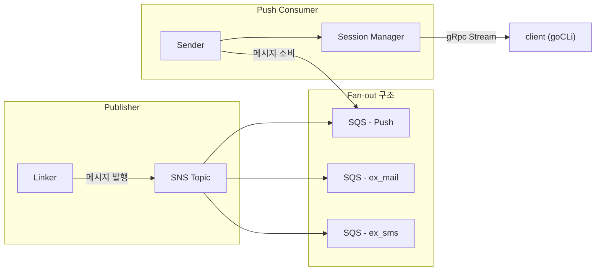

# Push Project

> Message Queue 기반 알림 Push 시스템

## 프로젝트 소개

본 프로젝트는 **메시지 큐**를 활용하여 내구성과 확장성을 확보한 Push 알림 전송 서버를 구축하는 개인 학습 프로젝트입니다.

<!--  -->

### 프로젝트 목적

- `분산 시스템`: 사용자 세션을 분산하여 고가용성과 확장성을 갖춘 구조를 이해하고 설계합니다.
- `비동기 메시지 처리`: 메시지 큐를 활용한 비동기적이고 내구성 있는 메시지 처리 구조를 이해합니다.
- `AWS 클라우드 환경 경험`: AWS 클라우드 서비스(SQS, SNS)를 직접 경험합니다.

### 프로젝트 구조



### 서비스

> 서비스 별 상세 기능은 아래 링크를 참고해 주세요.

- [Linker](linker/README.md): 메시지를 수집하고 AWS SNS 토픽에 발행하는 역할을 합니다. 알림 전송의 시작점이 되는 Publisher입니다.
- [sender](sender/README.md): AWS SQS로부터 메시지를 비동기적으로 소비하고, 이를 세션 매니저에게 전달하는 중간 처리 역할을 수행합니다.
- [session-manager](sessionmanager/README.md): 클라이언트(goCLi)와 gRPC 스트림을 통해 세션을 유지하며, 전달받은 메시지를 실시간으로 사용자에게 전송합니다.

## 프로젝트 중 겪은 고민과 해결방안

- [메시지 상태 업데이트 책임 위치 및 처리 방식](https://opjt.github.io/til/Project/push-project/messageUpdate.html)
- [수십만 세션을 pod에 분산하려면 어떤 구조가 필요할까?](https://opjt.github.io/til/Project/push-project/session.html)

## 프로젝트 실행하기 (개발환경)

1. **환경변수 설정**

     `.env.sample` 파일을 복사하여 `.env` 파일을 생성한 후 값을 기입해 주세요.

2. **docker 컨테이너 실행 및 인프라 설정**

     `docker compose up -d`로 Docker 컨테이너를 실행합니다  
     컨테이너 실행 후, 로컬 인프라(AWS LocalStack, DB)를 아래 명령어로 설정해 주세요:

     ```bash
     make aws # localstack aws 서비스 설정.
     make db-setup # 디비 스키마 적용
     ```

3. **서비스 개별 실행**

     각 서비스를 아래 명령어로 실행할 수 있습니다:

     ```bash
     go run linker/main.go # linker 서비스 실행
     go run sessionmanager/main.go #  session-manager 실행
     go run sender/main.go #  session-manager 실행
     ```
