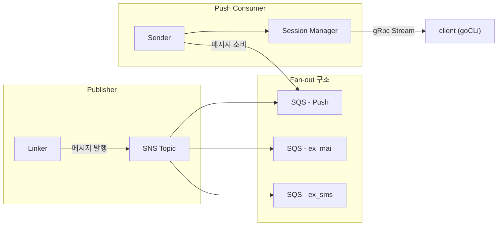

# Push Project

> Message Queue 기반 알림 Push 시스템

## 프로젝트 소개

본 프로젝트는 **메시지 큐**를 활용하여 내구성과 확장성을 확보한 Push 알림 전송 서버를 구축하는 개인 학습 프로젝트입니다. 비동기 메시지 처리를 위해 **AWS SNS 및 SQS** 메시지 큐 시스템을 중심으로 설계했습니다.

### 프로젝트 목적

- `마이크로서비스 아키텍처`: 마이크로서비스 원리에 대한 이해를 높입니다.
- `비동기 메시지 처리`: 메시지 큐를 활용한 비동기적이고 내구성 있는 메시지 처리 구조를 이해합니다.
- `AWS 클라우드 환경 경험`: AWS 클라우드 서비스(SQS, SNS, IAM)를 직접 경험합니다.

### 프로젝트 구조

## 서비스

- [Linker](linker/README.md): 메시지를 SNS에 발행하는 Publisher
- [sender](dispatcher/README.md): SQS로부터 메시지를 읽고 클라이언트에 전달하는 Sender

