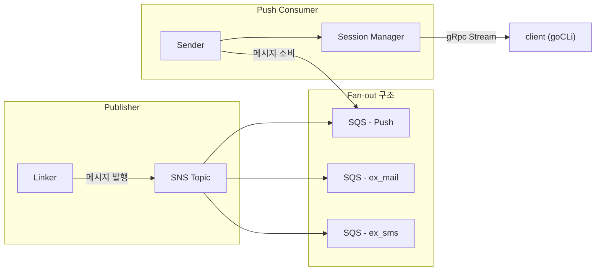

# Push Project

> Message Queue 기반 알림 Push 시스템

## 프로젝트 소개

본 프로젝트는 **메시지 큐**를 활용하여 내구성과 확장성을 확보한 Push 알림 전송 서버를 구축하는 개인 학습 프로젝트입니다. 비동기 메시지 처리를 위해 **AWS SNS 및 SQS** 메시지 큐 시스템을 중심으로 설계했습니다.

### 프로젝트 목적

- `마이크로서비스 아키텍처`: 마이크로서비스 원리에 대한 이해를 높입니다.
- `비동기 메시지 처리`: 메시지 큐를 활용한 비동기적이고 내구성 있는 메시지 처리 구조를 이해합니다.
- `AWS 클라우드 환경 경험`: AWS 클라우드 서비스(SQS, SNS, IAM)를 직접 경험합니다.

### 프로젝트 구조



### 서비스

- [Linker](linker/README.md): 메시지를 SNS에 발행하는 Publisher
- [sender](dispatcher/README.md): SQS로부터 메시지를 읽고 클라이언트에 전달하는 Sender

## 프로젝트 실행하기 (개발환경)

1. **환경변수 설정**

     `.env.sample` 파일을 복사하여 `.env` 파일을 생성한 후 값을 기입해 주세요.

2. **docker 컨테이너 실행 및 인프라 설정**

     `docker compose up -d`로 Docker 컨테이너를 실행합니다  
     컨테이너 실행 후, 로컬 인프라(AWS LocalStack, DB)를 아래 명령어로 설정해 주세요:

     ```bash
     make aws # localstack aws 서비스 설정.
     make db-setup # 디비 스키마 적용
     ```

3. **서비스 개별 실행**

     각 서비스를 아래 명령어로 실행할 수 있습니다:

     ```bash
     go run linker/main.go # linker 서비스 실행
     go run dispatcher/main.go # sender, session-manager 실행
     ```
